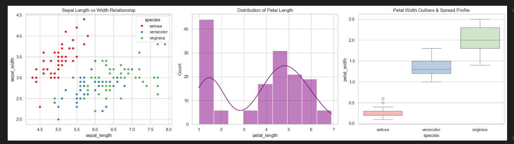
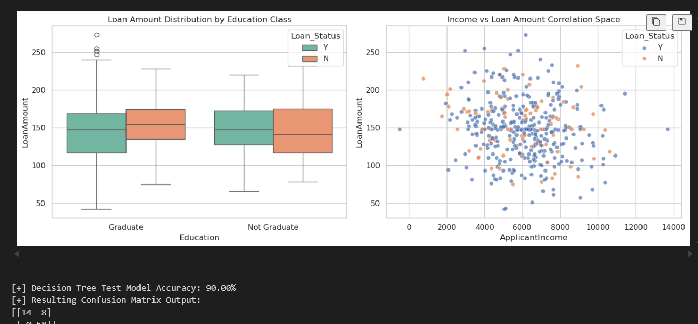
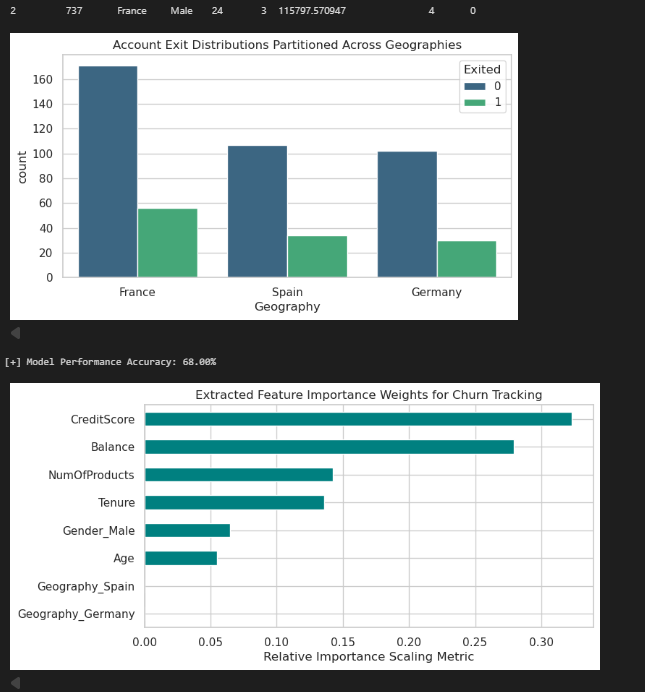

```markdown
# 📊 DevelopersHub Data Science Internship - Phase 1


## 🚀 Project Overview

This repository contains my submission for **Phase 1** of the **DevelopersHub Corporation Data Science Internship Program**.

The objective of this task was to perform a complete data analysis workflow, including:

- 📥 Data Collection
- 🧹 Data Cleaning
- 🔄 Data Preprocessing
- 📊 Exploratory Data Analysis (EDA)
- 📈 Data Visualization
- 💡 Extracting Meaningful Insights

This project demonstrates the practical application of Python and popular data science libraries to analyze real-world datasets.

---

## 🛠️ Tech Stack

- Python 3
- Pandas
- NumPy
- Matplotlib
- Seaborn
- Jupyter Notebook

---

## 📂 Repository Structure

```

DevelopersHub_DataScience_Task_Phase1/
│
├── data/
│   └── dataset.csv
│
├── notebook/
│   └── analysis.ipynb
│
├── screenshots/
│   ├── output1.png
│   ├── output2.png
│   └── output3.png
│
├── requirements.txt
└── README.md

````

---

## 🔍 Project Workflow

### 1️⃣ Data Loading
- Imported dataset using Pandas.
- Examined rows, columns, and data types.

### 2️⃣ Data Cleaning
- Removed duplicates.
- Handled missing values.
- Fixed inconsistent formatting.

### 3️⃣ Exploratory Data Analysis (EDA)
- Statistical summaries.
- Correlation analysis.
- Distribution analysis.
- Pattern identification.

### 4️⃣ Data Visualization
Created multiple visualizations to better understand the dataset:

- Bar Charts
- Histograms
- Scatter Plots
- Heatmaps
- Count Plots

### 5️⃣ Insights
Generated meaningful observations and conclusions from the data analysis process.

---

## 📸 Project Screenshots

### 🖥️ Output 1



---

### 📊 Output 2



---

### 📈 Output 3



---

## ⚙️ Installation

Clone the repository:

```bash
git clone https://github.com/alihuzaifa2004/DevelopersHub_DataScience_Task_Phase1.git
````

Move into the project directory:

```bash
cd DevelopersHub_DataScience_Task_Phase1
```

Install the required libraries:

```bash
pip install -r requirements.txt
```

Launch Jupyter Notebook:

```bash
jupyter notebook
```

Open the notebook file and run all cells.

---

## 🎯 Learning Outcomes

✔ Practical experience with real-world datasets.

✔ Data preprocessing and cleaning techniques.

✔ Exploratory Data Analysis (EDA).

✔ Data visualization using Matplotlib and Seaborn.

✔ GitHub repository management and documentation.

---

## 📌 Internship Details

**Organization:** DevelopersHub Corporation

**Program:** Data Science Internship

**Task:** Phase 1

---

## 🔗 Connect With Me

### GitHub

https://github.com/alihuzaifa2004

### LinkedIn

https://www.linkedin.com/in/YOUR-LINKEDIN-USERNAME

---

## ⭐ Support

If you found this project useful, consider giving it a ⭐ on GitHub.

It motivates me to continue building and sharing more projects.

---

## 📄 License

This project is developed for educational and internship purposes.

```
```
